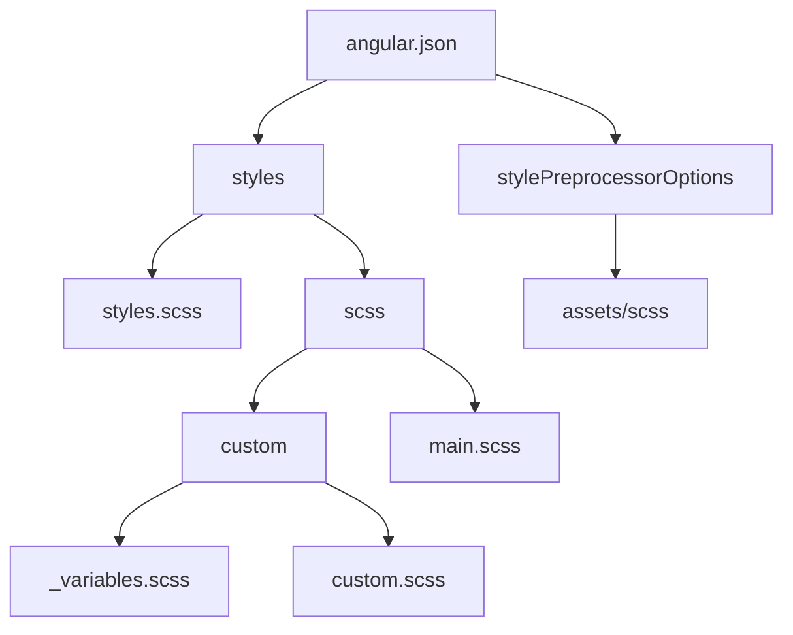

### The custom workflow

1. `styles.scss`: the global scss

2. `main.scss`: includes utilizes scss

3. create a custom folder where includes 2 files:

- `_variables.scss`: typography and palette variables
- `custom.scss`: define root style

### Simple flow chart

### Colors ([Taiga UI](https://taiga-ui.dev/colors))

| Variable            | Color                   | Description                                                                                |
| :------------------ | :---------------------- | ------------------------------------------------------------------------------------------ |
| **Base palette**    |                         |                                                                                            |
| base-01             | `#fff`                  |                                                                                            |
| base-02             | `#f6f6f6`               | - page primary background   - subtitle   - icon fill for color inverted background |
| base-03             | `#ededed`               | table borders, islands and blocks                                                          |
| base-04             | `#d7d7d7`               | background of buttons icons                                                                |
| base-05             | `#b0b0b0`               | interface icons color                                                                      |
| base-06             | `#959595`               | hovered color for interactive interface icons with --tui-base-05 color                     |
| base-08             | `#333`                  | alternative interface icons color                                                          |
| primary             | `#526ed3`               | - hovered island border   - other interactive blocks                                   |
| primary-active      | `#314692`               | active state text or background of buttons                                                 |
| **Text**            |                         |                                                                                            |
| text-01             | `#1b1f3b`               | - primary text   - headings                                                            |
| text-02             | `rgba(27, 31, 59, .65)` | - secondary text   - descriptions                                                      |
| text-03             | `rgba(27, 31, 59, .4)`  | - inactive and additional points   - minor information and helpers                     |
| link                | `#526ed3`               | - link   - secondary buttons text                                                      |
| link-hover          | `#6c86e2`               | hovered state of link and secondary buttons text                                           |
| **Support palette** |                         |                                                                                            |
| error-fill          | `#f45725`               | icons or other elements with error status                                                  |
